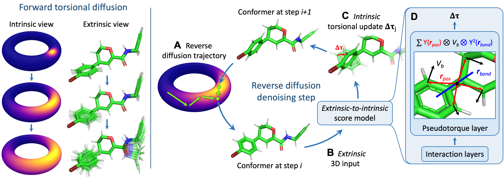

# Torsional Diffusion for Molecular Conformer Generation

Implementation of [Torsional Diffusion for Molecular Conformer Generation](https://arxiv.org/abs/2206.01729) by B Jing,* G Corso,* J Chang, R Barzilay and T Jaakkola.

Torsional diffusion is the state-of-the-art method for molecular conformer generation on the GEOM-DRUGS dataset and the first machine learning method to consistently outperform the established commercial software OMEGA. Torsional diffusion uses a novel diffusion framework that operates on the space of torsion angles via a diffusion process on the hypertorus and an extrinsic-to-intrinsic score model. It also provides exact likelihoods, which are used build the first generalizable Boltzmann generator.

If you have questions, don't hesitate to open an issue or send us an email at gcorso@mit.edu and bjing@mit.edu.

## Setting up Conda environment

Create new [Conda](https://docs.anaconda.com/anaconda/install/index.html) environment using `environment.yml`. You might need to adjust the `cudatoolkit` version to match your cuda version or set `cpuonly`.

    conda env create -f environment.yml
    conda activate torsional_diffusion

Install `e3nn` using pip:

    pip install e3nn

If you run into issues when importing `torch_geometric`, try to install `pyg` after having installed `pytorch` and check that they both have the right cuda/cpu version. 

## Generate conformers from SMILES

To use our trained models download the `workdir` directory from [this shared Drive](https://drive.google.com/drive/folders/1BBRpaAvvS2hTrH81mAE4WvyLIKMyhwN7?usp=sharing). To generate conformers using the trained model, create a `smiles.csv` file containing at every line `smile_str, num_conformers, smile_str` (for example `CN1C=NC2=C1C(=O)N(C(=O)N2C)C, 10, CN1C=NC2=C1C(=O)N(C(=O)N2C)C`) where `smile_str` is the SMILE representation of the molecule (note: technically the first is the one used as identifier of the molecule and the second the one used to create it but we suggest to keep them the same). Then you can generate the conformers running:

    python generate_confs.py --test_csv smiles.csv --inference_steps 20 --model_dir workdir/drugs_default --out conformers_20steps.pkl --tqdm --batch_size 128 --no_energy

This script saves to `conformers_20steps.pkl` a dictionary with the SMILE as key and the RDKit molecules with generated conformers as value. By default it generates for every row in `smiles.csv` `2*num_confs` conformers, if you are interested in a fixed number of conformers you can specify it with the `--confs_per_mol` parameter.

## Training model

Download and extract all the relevant data from the compressed `.tar.gz` folders from [this shared Drive](https://drive.google.com/drive/folders/1BBRpaAvvS2hTrH81mAE4WvyLIKMyhwN7?usp=sharing) putting them in the subdirectory `data`. These contain the GEOM datasets used in the project (license CC0 1.0), the splits from GeoMol and the pickle files with preprocessed molecules (see below to recreate them) and are divided based on the dataset they refer to. Then, you can start training:

    python train.py --log_dir [WORKDIR]

Details on all tunable hyperparameters or how to point to different datasets can be found in  `utils/parsing.py`. The first time the training is run, a featurisation procedure starts (about 2h on single core CPU, faster with more cores) and caches the result so that it won't be required the next time training is run.

## Running evaluation

In order to evaluate a model on the test set of one of the datasets you need to first download the data (see section above, but the only files needed are `test_smiles.csv`, list of SMILES strings and the number of conformers, and `test_mols.pkl`, dictionary of ground truth conformers). Locate the work directory of your trained model and, then, you can generate the conformers with the model via:

    python generate_confs.py --test_csv data/DRUGS/test_smiles.csv --inference_steps 20 --model_dir workdir/drugs_default --out workdir/drugs_default/drugs_20steps.pkl --tqdm --batch_size 128 --no_energy

Finally, evaluate the error of the conformers using the following command:

    python evaluate_confs.py --confs workdir/drugs_default/drugs_steps20.pkl --test_csv data/DRUGS/test_smiles.csv --true_mols data/DRUGS/test_mols.pkl --n_workers 10

To relax and predict the ensemble properties, use the `optimize_confs.py` script. Note that this requires to also locally have [xTB](https://xtb-docs.readthedocs.io/en/latest/setup.html) installed and to specify its installation path as an argument.

## Conformer matching

If you are planning on training torsional diffusion on your own dataset or testing different local structure samplers, you will first have to run the conformer matching procedure. This is performed by the `standardize_confs.py` script, which assumes that you have the files organised in individual pickle files as by default in GEOM. You can run the conformer matching procedure in parallel on many workers with the following bash script (assuming you have 300k molecules in your dataset, adjust the limits based on your dataset size):

    for i in $(seq 0, 299); do
        python standardize_confs.py --out_dir data/DRUGS/standardized_pickles --root data/DRUGS/drugs/ --confs_per_mol 30 --worker_id $i --jobs_per_worker 1000 &
    done

## Torsional Boltzmann generator

To train the torsional Boltzmann generator reported in the paper at temperature 500K, run:

    python train.py --boltzmann_training --boltzmann_weight --sigma_min 0.1 --temp 500 --adjust_temp --log_dir workdir/boltz_T500 --cache data/cache/boltz10k --split_path data/DRUGS/split_boltz_10k.npy --restart_dir workdir/drugs_seed_boltz/

Then to test it:

    python test_boltzmann.py --model_dir workdir/boltz_T500 --temp 500 --model_steps 20 --original_model_dir /workdir/drugs_seed_boltz/ --out boltzmann.out

## Citation
    @article{jing2022torsional,
          title={Torsional Diffusion for Molecular Conformer Generation}, 
          author={Bowen Jing and Gabriele Corso and Jeffrey Chang and Regina Barzilay and Tommi Jaakkola},
          journal={arXiv preprint arXiv:2206.01729},
          year={2022}
    }

## License
MIT
